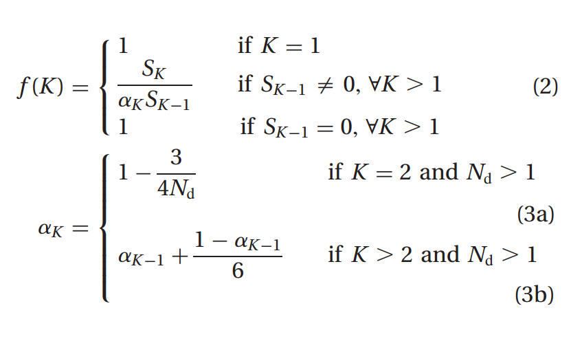

# Python Implementation of f(K) function
This repo contains a [Jupyter notebook](https://github.com/Vonatzki/pham_dimov_python/blob/master/Pham-Dimov%20Python%20Implementation.ipynb) that shows a Python implementation of the f(K) function of Pham, Dimov, and Nguyen from 2004. The value of f(K) is the ratio of the real distortion to the estimated distortion and is close to 1 when the data distribution is uniform. Equation of the function as follows:

